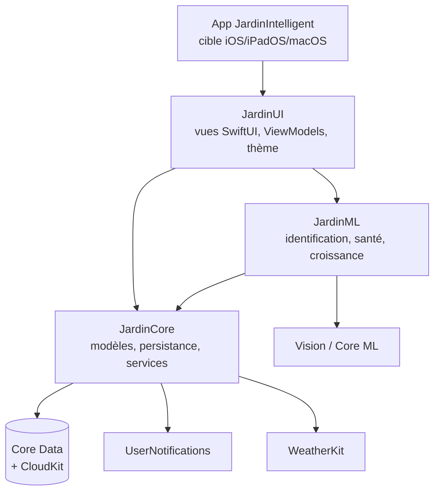

# 🌱 Jardin Intelligent

Application native Apple (iOS 17+, iPadOS 17+, macOS 14+) de gestion de jardin :
carte interactive, fiches de culture, reconnaissance de plantes par photo avec
**apprentissage continu sur l'appareil**, suivi des récoltes avec analyses
croisées, notifications d'entretien ajustées à la météo.

100 % SwiftUI + frameworks Apple (Core Data, CloudKit, Vision, Core ML,
Swift Charts, WeatherKit, UserNotifications). **Aucune dépendance externe.**

---

## Sommaire
1. [Fonctionnalités](#fonctionnalités)
2. [Architecture](#architecture)
3. [Prise en main](#prise-en-main)
4. [Mode démo](#mode-démo)
5. [Ajouter une plante à la base](#ajouter-une-plante-à-la-base)
6. [Reconnaissance : entraîner et améliorer le modèle](#reconnaissance--entraîner-et-améliorer-le-modèle)
7. [Exporter / importer les données d'apprentissage](#exporter--importer-les-données-dapprentissage)
8. [Icônes de plantes](#icônes-de-plantes)
9. [Tests](#tests)
10. [Déployer sur l'App Store](#déployer-sur-lapp-store)
11. [Choix techniques notables](#choix-techniques-notables)

---

## Fonctionnalités

| Domaine | Détail |
|---|---|
| **Carte du jardin** | zones à main levée ou prédéfinies, drag & drop des plantes, zoom/panoramique, affectation automatique zone↔plante, export PDF |
| **Fiches plantes** | 22 espèces pré-remplies (eau, lumière, sol, bouturage, conservation, compagnonnage, calendriers semis/récolte, rendement moyen) — chaque champ personnalisable, par plante ou par espèce |
| **Reconnaissance** | photo → candidats avec % de confiance, 4 sources en cascade (kNN personnel → Core ML embarqué → taxonomie Vision → API en ligne optionnelle), validation/correction qui améliore le système |
| **Analyse photo** | santé du feuillage (jaunissement, taches — avec causes probables), suivi de croissance entre photos (surface visible), stade estimé |
| **Récoltes** | saisie (quantité, qualité, conservation, photo), Swift Charts par mois/plante/zone, comparaison à la moyenne de l'espèce et entre zones |
| **Analyses automatiques** | « rendement −40 % vs l'an dernier ; vos photos montrent “excès d'eau” à 2 reprises → excès d'arrosage probable », tags récurrents, santé en déclin |
| **Notifications** | arrosage (intervalle selon besoin ± météo : reporté si pluie prévue), début de période de récolte, alertes d'analyse — désactivables par plante |
| **Recherche** | plein texte (noms, notes, tags d'observations) avec autocomplétion + filtres (type, eau, lumière, mois de récolte, zone, tag, problèmes récents) |
| **Sync iCloud** | CloudKit via `NSPersistentCloudKitContainer`, photos comprises ; repli local propre sans compte iCloud |
| **Exports** | plantes & récoltes (CSV/JSON), carte (PDF), dataset d'apprentissage (photos + tags + empreintes) |

## Architecture

MVVM + services, découpé en **3 modules Swift Package** (`Packages/Jardin`) :



- **JardinCore** — entités Core Data (modèle défini *par code*, voir
  [choix techniques](#choix-techniques-notables)), `PersistenceController`
  (CloudKit + repli local), `GardenStore` (façade de mutations), catalogue
  d'espèces, services purs et testables : `WateringPlanner`,
  `HarvestAnalytics`, `InsightEngine`, `ExportService`, météo, notifications.
- **JardinML** — `CompositePlantIdentifier` (pipeline 4 étages),
  `PersonalPlantClassifier` (kNN sur empreintes Vision = apprentissage continu),
  `PlantHealthAnalyzer` (masque de premier plan + colorimétrie HSV),
  `GrowthAnalyzer`. La frontière avec Core est le type valeur
  `ObservationAnalysis` : ML analyse, Core persiste.
- **JardinUI** — vues et ViewModels ; listes via `@FetchRequest` (réactif,
  sans fuite), logique de flux dans les ViewModels (`RecognitionViewModel`,
  `GardenMapViewModel`). Navigation adaptative : onglets sur iPhone,
  `NavigationSplitView` sur iPad/macOS.

Toutes les opérations longues (analyse photo, réseau, sync) sont en
`async/await` ; le travail Vision s'exécute hors du main actor.

## Prise en main

Prérequis : Xcode 15+ sur macOS 14+. **Aucun outil à installer.**

```bash
git clone <repo> && cd La-Prairie
open JardinIntelligent.xcodeproj
```

Le projet committé est prêt à l'emploi : sélectionner un **simulateur iPhone**
et ⌘R. Il est volontairement configuré **sans signing team ni capacités**
(iCloud, WeatherKit) pour se lancer immédiatement — l'app fonctionne alors en
stockage local, sans météo (dégradations prévues par le code). Pour tout voir
tourner tout de suite : **Réglages → Mode démo**.

Pour activer la synchronisation iCloud et la météo (appareil réel, compte
développeur) :
1. Cible **JardinIntelligent** → *Signing & Capabilities* → sélectionner votre
   **Team**, puis ajouter les capacités *iCloud (CloudKit)*, *Push
   Notifications* et *WeatherKit* — ou pointer `CODE_SIGN_ENTITLEMENTS` vers
   `App/Support/JardinIntelligent-iOS.entitlements` fourni.
2. Dans `App/Support/Info.plist`, passer **`JIEnableCloudSync` à `YES`** :
   c'est ce verrou (à `NO` dans le projet committé) qui autorise l'app à
   toucher CloudKit — sans lui, un build dépourvu d'entitlement iCloud
   planterait au démarrage (exception CloudKit incatchable).
3. Laisser Xcode créer le conteneur `iCloud.com.laprairie.jardinintelligent`
   (ou changer l'identifiant dans l'Info.plist, clé
   `JIICloudContainerIdentifier`, et dans les entitlements).
4. Lancer l'app avec un **compte iCloud connecté** (Réglages de l'appareil ou
   du simulateur) — sans compte, l'app reste sereinement en stockage local,
   l'état est visible dans *Réglages → iCloud*.

<details>
<summary>Variante macOS / multiplateforme via XcodeGen (optionnelle)</summary>

Le projet committé cible iOS/iPadOS (simulateur sans configuration). Pour une
cible **iOS + macOS** avec entitlements pré-câblés, générez le projet complet :

```bash
brew install xcodegen
xcodegen generate   # régénère JardinIntelligent.xcodeproj depuis project.yml
```
(Renseignez `DEVELOPMENT_TEAM` dans `project.yml`.)
</details>

## Mode démo

**Réglages → Mode démo** : bascule sur une base *en mémoire* contenant un jardin
complet (3 zones, 12 plantes, deux saisons de récoltes, observations taguées avec
photos générées) — cartes, graphiques et analyses sont immédiatement parlants,
sans toucher à vos données réelles. Rebasculez l'interrupteur pour revenir à
votre jardin.

## Ajouter une plante à la base

### Dans l'app (utilisateur)
- **Reconnaissance** (`Plantes → 📷`) : une identification validée dont l'espèce
  n'existe pas crée automatiquement une fiche minimale, complétable ensuite.
- **Manuellement** : `Plantes → +`, recherche d'espèce avec autocomplétion, ou
  création sans fiche (catégorie seule).
- Les fiches sont éditables dans le détail d'une plante (« Modifier la fiche ») ;
  les besoins eau/lumière/sol se surchargent **par plante** dans « Entretien »
  (ex : « besoin en eau » passé de *moyen* à *élevé* pour votre climat).

### Dans le catalogue livré (développeur)
1. Ouvrir `Packages/Jardin/Sources/JardinCore/Seed/SpeciesCatalog.swift`.
2. Ajouter un `SpeciesSeed(...)` (tous les champs sont documentés par l'exemple :
   besoins, sol, bouturage, conservation, mois — 1 à 12 —, compagnons…).
3. Le seed n'insère que si la base d'espèces est vide : sur un appareil déjà
   installé, la nouvelle fiche apparaît après réinstallation *ou* en
   l'ajoutant via l'app. Les tests `SeedCatalogTests` valident la complétude.
4. Option : ajouter l'icône dédiée (voir [Icônes](#icônes-de-plantes)) et le
   mot-clé correspondant dans `PlantIconKind.detect`.

## Reconnaissance : entraîner et améliorer le modèle

La reconnaissance fonctionne **dès l'installation, sans entraînement ni réseau**
(taxonomie Vision). Le pipeline complet, du plus personnalisé au plus générique :

| Étage | Source | Disponibilité |
|---|---|---|
| 1 | **kNN personnel** — empreintes Vision de *vos* photos validées/corrigées | dès 3 exemples |
| 2 | **Modèle Core ML embarqué** (`PlantClassifier.mlmodelc`) | si présent dans le bundle |
| 3 | **Taxonomie Vision** (~1300 classes, hors-ligne) | toujours |
| 4 | **API en ligne** Pl@ntNet / Plant.id | si clé configurée **et** confiance locale < 50 % |

Les candidats sont fusionnés (bonus quand plusieurs sources concordent) et
affichés avec leur % de confiance et leur source.

- **Modèle initial** : voir [`MLTraining/README.md`](MLTraining/README.md) —
  entraînement PyTorch → Core ML sur PlantVillage / Pl@ntNet-300K / iNaturalist
  (ou Create ML sans Python), puis glisser le `.mlpackage` dans la cible Xcode.
- **Apprentissage continu (immédiat, on-device)** : chaque validation ou
  correction (« Ce n'est pas du basilic, c'est de la menthe ») stocke photo +
  empreinte + étiquette ; le kNN personnel en tient compte dès la photo
  suivante. Les corrections pèsent naturellement plus lourd (voisins exacts).
- **Apprentissage continu (périodique)** : réentraîner le modèle embarqué avec
  vos données via `MLTraining/retrain_from_export.py` (les corrections sont
  sur-échantillonnées), ou produire un kNN Core ML *updatable* (`--knn`).
- **API de secours** : Réglages → Reconnaissance ; la photo n'est envoyée en
  ligne que dans ce cas précis.

## Exporter / importer les données d'apprentissage

- **Export** : Réglages → *Données d'apprentissage* → *Exporter le dataset* →
  dossier `JardinApprentissage-<date>/` (`manifest.json` + `images/`) dans les
  Documents de l'app, partageable (AirDrop, Fichiers…). Format détaillé dans
  [`MLTraining/README.md`](MLTraining/README.md#3-format-dexport-de-lapp).
- **Import** : Réglages → *Importer un dataset* → sélectionner le dossier.
  Fusion par identifiant, ré-import sans doublon.
- Les exemples se synchronisent aussi via iCloud entre vos appareils
  (sauvegarde automatique comprise).

## Icônes de plantes

Deux mécanismes complémentaires, même langage visuel (minimaliste, palette
`#2E8B57 #556B2F #90EE90 #F5F5DC #DEB887`) :

1. **In-app, à la volée** : `PlantIconView` dessine paramétriquement (Canvas)
   24 silhouettes (tomate, basilic, romarin, carotte…) choisies par mot-clé du
   nom d'espèce — toute nouvelle plante a une icône sans asset.
2. **Assets statiques** : `Scripts/generate_plant_icons.py` génère les SVG
   512×512 committés dans `App/Resources/PlantIcons/` (+ `appicon.svg`).
   Génération locale, déterministe, sans API :

```bash
python3 Scripts/generate_plant_icons.py          # SVG
python3 Scripts/generate_plant_icons.py --png    # + PNG (pip install cairosvg)
```

## Tests

Les services critiques sont couverts par des tests unitaires **purs** (sans
simulateur ni réseau) dans le package :

```bash
cd Packages/Jardin
swift test          # ou : schéma « Jardin-Package » dans Xcode (⌘U)
```

| Suite | Couvre |
|---|---|
| `PersistenceTests` | round-trip Core Data, **garde-fous CloudKit** (attributs optionnels/défaut, inverses, pas de Deny), politique de fusion, suppressions en cascade, zones |
| `WateringPlannerTests` | intervalles, retards, report pluie |
| `HarvestAnalyticsTests` | agrégations, année/année, disparités entre zones, tags récurrents, tendance santé |
| `InsightEngineTests` | seuils, corrélation photos↔rendement, stabilité des clés de déduplication |
| `ExportServiceTests` | échappement CSV, JSON ISO 8601, **round-trip export/import du dataset** |
| `SeedCatalogTests` | complétude des 22 fiches, idempotence du seed, jardin démo |
| `PersonalClassifierTests` | kNN : plus proche cluster, **effet d'une correction**, rejets |
| `HealthMathTests` / `GrowthAnalyzerTests` | colorimétrie sur tampons synthétiques, croissance, stades |

## Déployer sur l'App Store

1. **Compte** [Apple Developer](https://developer.apple.com) (99 €/an).
2. **Identifiants** : App ID `com.laprairie.jardinintelligent` avec capacités
   iCloud (CloudKit), Push Notifications, WeatherKit ; conteneur
   `iCloud.com.laprairie.jardinintelligent` (tout est créable automatiquement
   par Xcode via *Automatically manage signing*).
3. **CloudKit** : après les tests en environnement *Development*, déployer le
   schéma vers *Production* — [CloudKit Console](https://icloud.developer.apple.com)
   → conteneur → *Deploy Schema Changes* (⚠️ obligatoire avant la review).
4. **Icône** : exporter `App/Resources/PlantIcons/appicon.svg` en PNG 1024×1024
   et l'ajouter à un asset catalog `AppIcon`.
5. **Archive** : Xcode → *Product > Archive* (une archive par plateforme iOS et
   macOS) → *Distribute App > App Store Connect*.
6. **App Store Connect** : fiche (captures iPhone/iPad/Mac, description,
   confidentialité : photos, localisation *optionnelle*, iCloud), puis
   TestFlight et soumission.
7. Chaque itération : incrémenter `CFBundleVersion` (`project.yml`).

## Choix techniques notables

- **Modèle Core Data défini par code** (`JardinModel.swift`) plutôt qu'un
  `.xcdatamodeld` : lisible en revue, versionnable, testable (les contraintes
  CloudKit sont vérifiées par un test), et partageable entre les deux
  containers (réel + démo) sans conflit de classes.
- **Conflits de sync** : suivi d'historique persistant +
  `NSMergeByPropertyObjectTrumpMergePolicy` (dernière écriture gagnante,
  propriété par propriété) — le standard Apple pour ce type d'app ; affiché
  dans Réglages → À propos.
- **Apprentissage continu sans réentraînement** : plutôt que `MLUpdateTask`
  (qui impose un modèle updatable et une orchestration lourde), l'app utilise
  des **empreintes Vision + kNN pur Swift** : mise à jour instantanée à chaque
  correction, zéro dépendance, testable — et le script `--knn` produit
  l'équivalent Core ML updatable si besoin.
- **Analyse de santé déterministe** (masque premier plan Vision + histogramme
  HSV) : explicable (« 32 % de feuillage jauni »), hors-ligne, sans dataset —
  les seuils sont dans `HealthMath` avec leurs tests.
- **Photos** : JPEG ≤ 1600 px + miniature, en attribut binaire *external
  storage* → CloudKit les transporte en `CKAsset` automatiquement.
- **Dégradations propres** : sans iCloud → stockage local (bannière d'état) ;
  sans entitlement WeatherKit → pas d'ajustement météo ; sans modèle embarqué →
  étage 2 sauté ; sans clé API → 100 % local.

## Structure du dépôt

```
├── App/                      # cible application (point d'entrée, entitlements, assets)
├── Packages/Jardin/          # les 3 modules SPM + tests
├── MLTraining/               # entraînement/réentraînement Core ML (Python)
├── Scripts/                  # génération des icônes SVG
└── project.yml               # définition du projet Xcode (XcodeGen)
```
